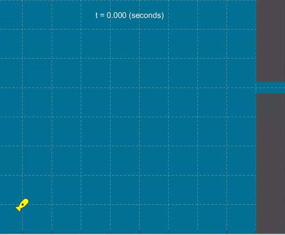

# Applied-Linear-Systems-AUV-Project-Part-1

**To design a state-feedback control system that can control the H-AUV (Autonomous Underwater Vehicle) depth and longitudinal position** 

#### Objectives Achieved: 

- Modeled MIMO dynamic systems using state-space techniques.
- Analytically and numerically solved for the dynamic response of any linear dynamic system and relate the response to the state-space system description.
- Analyzed the open-loop and closed-loop stability of any state-space representation.
- Designed linear state-feedback controllers using pole placement techniques.

  

#### Languages Used:
- Matlab
- Latex 

#### Use of each file:
- **Midterm_Project_Japnit_Sethi.mlx** - Executable file with learly defined problem statement and approach
- **Midterm_Project_Japnit_Sethi.pdf** - Published Document for a quick check of Solutions and Code
- **animate_auv.p** - Animation code used throughout the code for easy visual and intuitive check
- **auv_animate.mp4** - Sample Example of auv motion when animate_auv.p is executed
- **Midterm_Project_Data** - Track of Iterations for Pole Placements method
